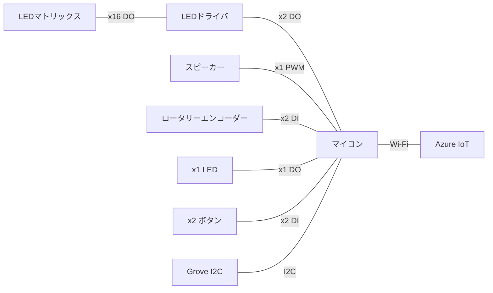

# algyan_8th

IoT ALGYAN 8周年 オリジナルIoTデバイスのリポジトリです。

ご質問、ご意見は、GitHub Discussionsへ。お気軽にどうぞ。

## タイムライン

1. (-12/E)どんなデバイスを作るか考える **←イマココ**
2. (-2/M)1st基板（サンプル）を作って機能とコスト感を確認する
3. (-2/E)2nd基板（配布）を製造する
4. (-3/M)2nd基板（配布）を動作確認する
5. (-3/E)ソフトを作る
6. (?)IoT ALGYAN 8周年イベントやる

## コンセプト

**"IoTをやってみたい人から、バリバリのベテランにも楽しんでもらえるIoTデバイスを目指す"**

* デバイス、ファームウェア、クラウドの全てにおいて、完成品（クラウドはお試しする場所）を提供するとともに、全ての範囲でカスタマイズ可能にする
   * 完成品デバイスはどうやって入手可能にするかなぁ
   * クラウドは期間を限定（たとえば、IoT ALGYANでイベントのときとか）すれば提供できそう
* 入手しやすい部品を使う（難しい...）
* 部品代は3000円以内にしたい（これも難しい...）
* 開発PCはWindows, macOS, Linux

## どんなデバイスにしよう？

* LEDマトリックスで、かっこいいパターンを表示するデバイス。こんなイメージ。https://www.youtube.com/watch?v=y8m3hBudrTc
* 操作の自由度を上げるために、ロータリーエンコーダーを追加。
* ベテランが楽しめるように、スピーカーを追加。
* もちろん、Azure IoTに接続可能。
* 持ち歩きできるように小型でバッテリーor乾電池駆動としたいが、これは将来バージョンで対応か。

### 構成

* LEDは、マイコン動作状態の表示
* ボタンは、確定とキャンセルの操作

### 部品リスト

| 部品名 | 数量 | 製品名 | 単価 | 販売店 | 部品コード | 備考 |
| :--- | :--- | :--- | :--- | :--- | :--- | :--- |
| マイコン | 1 | Ｓｅｅｅｄ　Ｓｔｕｄｉｏ　ＸＩＡＯ　ＥＳＰ３２Ｃ３ | 940 | 秋月電子通商 | M-17454 | |
| LEDマトリックス | 1 | 黄色ドットマトリクスＬＥＤ　８×８ドット　ＯＳＬ６４１５０１－ＡＹ | 150 | 秋月電子通商 | I-07662 | 38x38mm |
| LEDドライバ | 1 | ７セグメント用ＬＥＤドライバーＩＣ（最大１６個）　ＴＭ１６４０ | 80 | 秋月電子通商 | I-13225 | 5V |
| スピーカー | 1 | マイクロスピーカー　赤／黒リード付　８Ω | 50 | 秋月電子通商 | P-12494 | 23x16mm |
| ロータリーエンコーダー | 1 | 表面実装用ロータリーエンコーダー　センタープッシュ付き | 200 | 秋月電子通商 | P-14936 | プッシュ付 |
| （単四電池BOX） | 1 | 電池ボックス　単４×２本　リード線・フタ・スイッチ付 | 110 | 秋月電子通商| P-00348 | フタ付、スイッチ付、コネクタ無 |
| （昇圧DCDC）| 1 | ＸＣＬ１０３使用３．３Ｖ出力昇圧ＤＣＤＣコンバーターキット | 300 | 秋月電子通商 | K-16116 | 3.3V出力、0.25A |

### マイコンI/Oマップ

| ピン番号 | XIAO ESP32C3 | XIAO BLE | 接続部品 |
| :--- | :--- | :--- | :--- |
| 1 | **D0**/A0 | **D0**/A0 | スピーカー |
| 2 | **D1**/A1 | **D1**/A1 | ロータリーエンコーダー |
| 3 | **D2**/A2 | **D2**/A2 | ロータリーエンコーダー |
| 4 | **D3**/A3 | **D3**/A3 | ボタン |
| 5 | D4/**SDA** | D4/A4/**SDA** | Grove I2C |
| 6 | D5/**SCL** | D5/A5/**SCL** | Grove I2C |
| 7 | **D6**/TX | **D6**/TX | LED |
| 8 | **D7**/RX | **D7**/RX | ボタン |
| 9 | D8/**SCK** | D8/**SCK** | LEDドライバ |
| 10 | D9/MISO | D9/MISO | NC |
| 11 | D10/**MOSI** | D10/**MOSI** | LEDドライバ |
| 12 | **3V3** | **3V3** |
| 13 | **GND** | **GND** |
| 14 | **5V** | **5V** |
