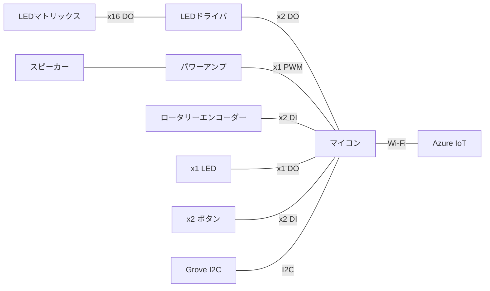
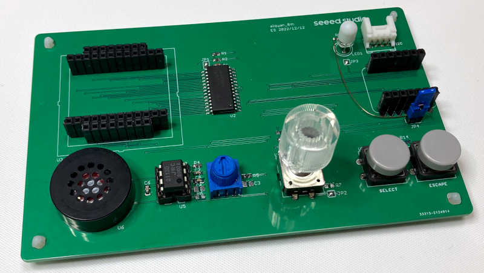
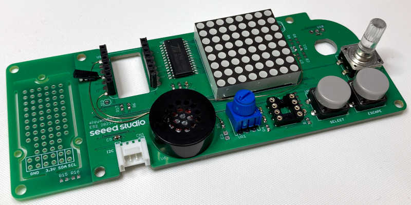
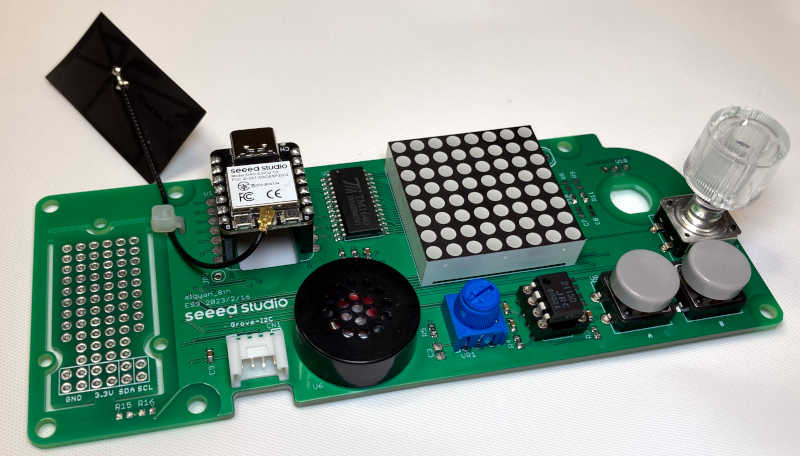

# XIAOGYAN

IoT ALGYAN 8周年 オリジナルIoTデバイス「XIAOGYAN」のリポジトリです。

ご質問、ご意見は、GitHub Discussionsへ。お気軽にどうぞ。

* [サンプルコード](https://github.com/algyan/xiaogyan_examples)
* [Arduino用ライブラリ](https://github.com/algyan/xiaogyan_arduino)

## タイムライン

1. (-12/E)どんなデバイスを作るか考える
2. (-2/M)1st基板（ES）を作って機能とコスト感を確認する
3. (-2/E)2nd基板（ES2）を製造する
4. (-3/M)2nd基板（ES2）を動作確認する
5. (-2/E)3rd基板（ES3）を製造する
6. (-3/M)3rd基板（ES3）を動作確認する **←イマココ**
7. (3/26)3rd基板（ES3）のフィードバック受付期限
8. (-3/E)ソフトを作る
9. (4/3)配布基板を製造する
10.(-4/E) 配布基板を動作確認する
11. (5/M-E)IoT ALGYAN 8周年イベントやる

## コンセプト

**"IoTをやってみたい人から、バリバリのベテランにも楽しんでもらえるIoTデバイスを目指す"**

* デバイス、ファームウェア、クラウドの全てにおいて、完成品（クラウドはお試しする場所）を提供するとともに、全ての範囲でカスタマイズ可能にする
   * 完成品デバイスはどうやって入手可能にするかなぁ
   * クラウドは期間を限定（たとえば、IoT ALGYANでイベントのときとか）すれば提供できそう
* 入手しやすい部品を使う（難しい...）
* 部品代は3000円以内にしたい（これも難しい...）
* 開発PCはWindows, macOS, Linux

## どんなデバイスにしよう？

* LEDマトリックスで、かっこいいパターンを表示するデバイス。こんなイメージ。https://www.youtube.com/watch?v=y8m3hBudrTc
* 操作の自由度を上げるために、ロータリーエンコーダーを追加。
* ベテランが楽しめるように、スピーカーを追加。
* もちろん、Azure IoTに接続可能。
* 持ち歩きできるように小型でバッテリーor乾電池駆動としたいが、これは将来バージョンで対応か。

### 構成

* LEDは、マイコン動作状態の表示
* ボタンは、確定とキャンセルの操作

## ハードウェア

### ES基板

* [回路図](hardware/algyan_8th.es.pdf)

### ES2基板

* [部品リスト](hardware/algyan_8th.es2.xlsx)
* [回路図](hardware/algyan_8th.es2.pdf)

### ES3基板

* [部品リスト](hardware/algyan_8th.es3.xlsx)
* [回路図](hardware/algyan_8th.es3.pdf)

### マイコンI/Oマップ（ES3基板）

| ピン番号 | XIAO ESP32C3 | XIAO BLE | 接続部品 |
| :--- | :--- | :--- | :--- |
| 1 | **D0**/A0 | **D0**/A0 | スピーカー |
| 2 | **D1**/A1 | **D1**/A1 | ロータリーエンコーダー（A相） |
| 3 | **D2**/A2 | **D2**/A2 | ロータリーエンコーダー（B相） |
| 4 | **D3**/A3 | **D3**/A3 | スピーカーENABLE/アナログ入力 |
| 5 | D4/**SDA** | D4/A4/**SDA** | Grove I2C（SDA） |
| 6 | D5/**SCL** | D5/A5/**SCL** | Grove I2C（SCL） |
| 7 | **D6**/TX | **D6**/TX | LED |
| 8 | **D7**/RX | **D7**/RX | Bボタン |
| 9 | D8/**SCK** | D8/**SCK** | LEDドライバ（SCLK） |
| 10 | **D9**/MISO | D9/MISO | Aボタン |
| 11 | D10/**MOSI** | D10/**MOSI** | LEDドライバ（DIN） |
| 12 | **3V3** | **3V3** |
| 13 | **GND** | **GND** |
| 14 | **5V** | **5V** |

## ソフトウェア

* [サンプルコード](https://github.com/algyan/xiaogyan_examples)
* [Arduino用ライブラリ](https://github.com/algyan/xiaogyan_arduino)
