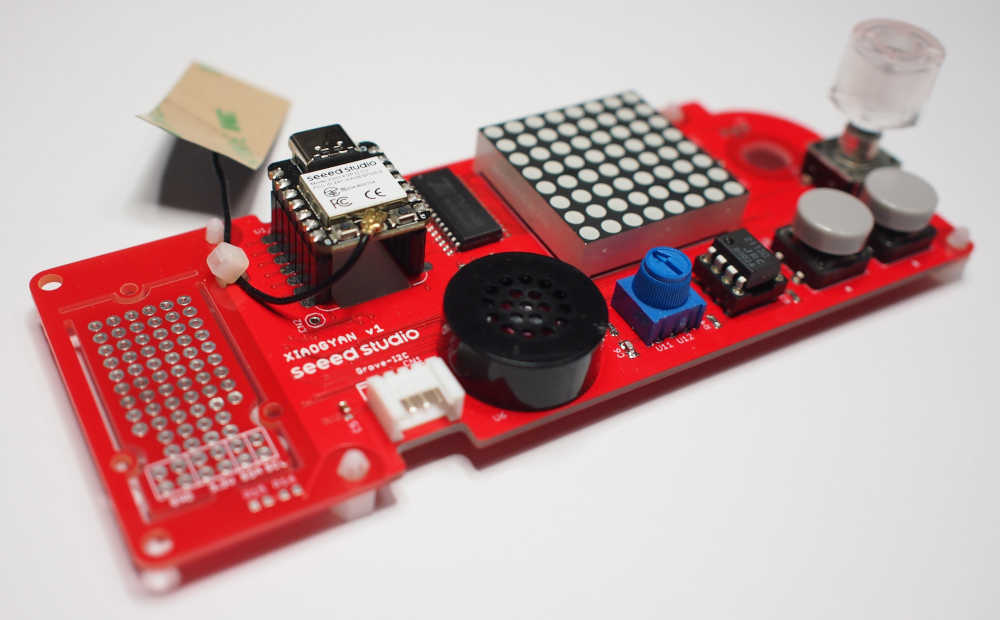
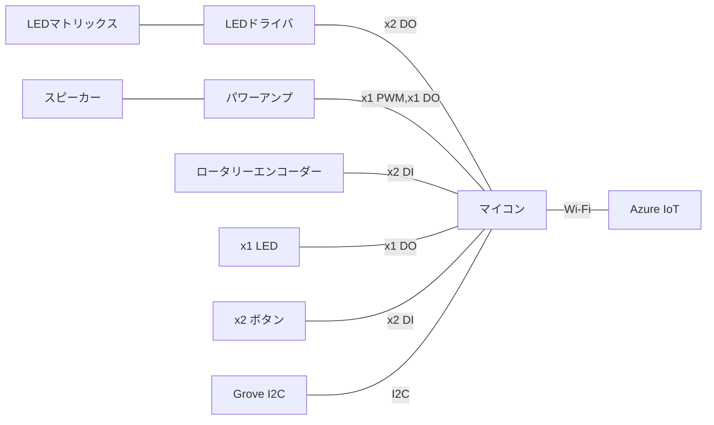

# XIAOGYAN

IoT ALGYAN 8周年 オリジナルIoTデバイス「XIAOGYAN」のリポジトリです。

IoTをやってみたい人から、バリバリのベテランにも楽しんでもらえるIoTデバイスを目指しています。

* デバイス、ファームウェア、クラウドの全てにおいて、完成品（クラウドはお試しする場所）を提供するとともに、全てをオープン、カスタマイズ可能に
* 入手しやすい部品（ほぼ全ての部品を秋月電子通商で入手できる）
* 部品代は3000円以内
* 開発PCはWindows, macOS, Linux

ご質問、ご意見は[Discussions](https://github.com/algyan/XIAOGYAN/discussions)や[Issues](https://github.com/algyan/XIAOGYAN/issues)へ。お気軽にどうぞ。

## 構成

## マニュアル

* [しおり（手引書）](manuals/guidebook/README.md)
* [部品手配マニュアル](manuals/order/README.md)
* 組立マニュアル - [PR](https://github.com/algyan/XIAOGYAN/pull/48)
* [動作確認マニュアル](manuals/test/README.md)
* [ソフト開発マニュアル](manuals/software/README.md)

## 事例

* [XIAOGYANやってみたよ！！ユーザー投稿](https://github.com/algyan/XIAOGYAN/discussions/50)

* [XIAOGYANbitLess](https://github.com/610t/XIAOGYANbitLess)

    XIAOGYANをScratchで使うためのプログラム

## リファレンス

* ハードウェア
  * [部品リスト](hardware/xiaogyan.v1.xlsx)
  * [部品貼付台紙](hardware/xiaogyan_pasteboard.v1.pdf)
  * [回路図](hardware/xiaogyan.v1.pdf)

* ソフトウェア
  * [サンプルコード](https://github.com/algyan/xiaogyan_examples)
  * [Arduino用ライブラリ](https://github.com/algyan/xiaogyan_arduino)
