# XIAOGYANの組立手順

IoT ALGYANの8周年基板の組立手順を示します．

# 1. はじめに
ハードウェア構成のイメージを持った後に，**部品の確認**と**機材の確認**を行いましょう！

## 1.2. ハードウェア構成の理解
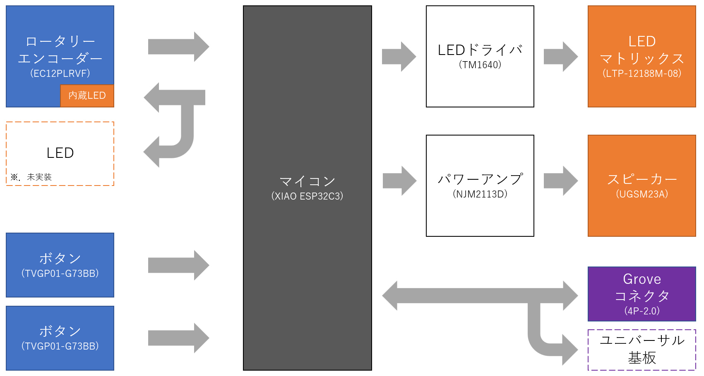

XIAOGYANの構成は，マイコン(XIAO ESP32C3)を中心に，入力としてロータリーエンコーダー，ボタン×2と，出力としてLEDマトリックス，スピーカーを有します．
また，ロータリーエンコーダーには，LEDが内蔵されています．この内蔵LEDの制御信号(D6)は分岐しており，基板上のLED(U13・未実装)にも接続されています．

加えて，I2Cの信号線が繋がるGroveコネクタも用意されており，任意のGroveモジュール(3.3V駆動品)を拡張する事も可能です．
I2Cの制御信号は，基板左のユニバーサル基板の区画にも伸びています．このユニバーサル基板に回路を拡張すればすべてオンボードとすることも可能です．

## 1.3. 完成品を見ておこう
// 図を入れる

先に完成したXIAOGYANを見ておきましょう！
沢山，はんだ付けする部品があるように見えますが，1つ1つ取り組んでいけばバッチリ組み上がります．頑張っていきましょう！

## 1.4. 部品の確認
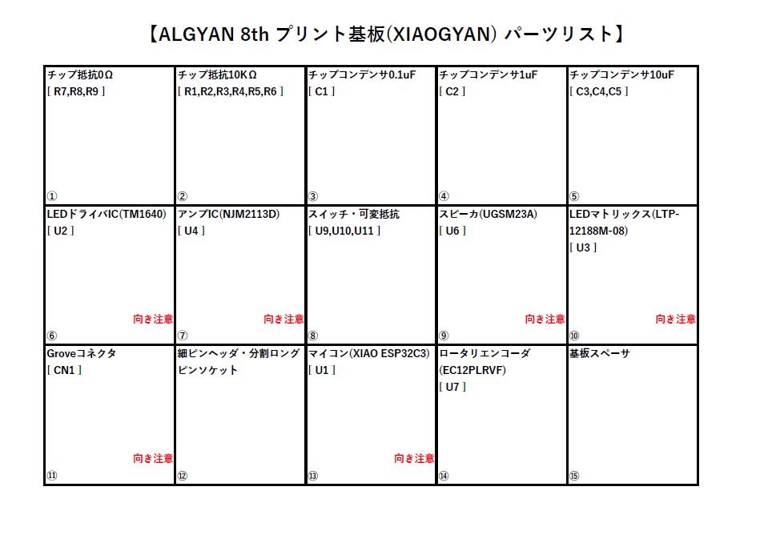

- [パーツリスト](./parts_list.pdf)

それでは，まず上記のパーツリストをダウンロード＆印刷し，部品を並べることで部品の不足が無いことを確認しましょう．

1. チップ抵抗やチップコンデンサは，袋から取り出すと，容量の確認が非常に困難です．袋から取り出す際には必ず容量(XXXΩ，YYYuFなど)を紙テープに書き込みましょう．
2. 部品の確認表に**赤字で「向き注意」** と書かれている部品は，**取り付けに向きがあります．** はんだ付けの際には注意しましょう．
3. それではパーツリストに部品を並べましょう！

## 1.5. 機材の確認
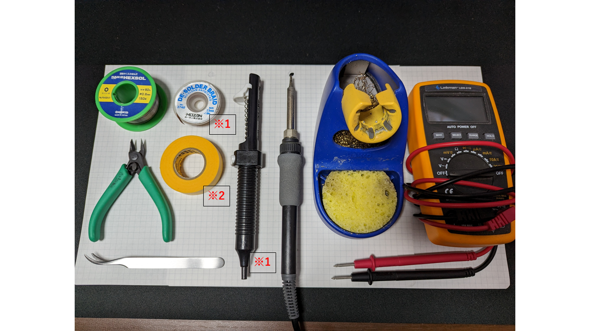

上記に組立に必要な機材のリストを示します．機材は手元に揃っていますか？
**※** マークのついた部品は，オプションです．手元に無くとも組立は可能です．

## 1.6. 組立＆動作確認の流れ
以降でXIAOGYANの組立＆動作確認を行います．組立は手慣れた人で1～2時間程度かと思われます．
流れは以下の通りです．

2. 組立作業
    1. 基板裏面のショートジャンパへのはんだ付け
    2. 表面実装品のはんだ付け
    3. 挿入実装品のはんだ付け
    4. 足の取り付け
    5. アンテナの固定
3. 動作確認
    1. ショートチェック
    2. 開発環境の構築
    3. 動作確認プログラムの書き込み
    4. 動作の確認

# 2. 組立作業
## 2.0. はんだ付けの経験が無い/浅い方へ

Youtberのイチケンさんのはんだ付け動画が分かりやすいです．
はんだ付けの経験が無い/浅い方は，一度ご覧の上で以降の作業に進むことをオススメします．表面実装の経験が無い方もぜひ！

## 2.0. 基板の確認
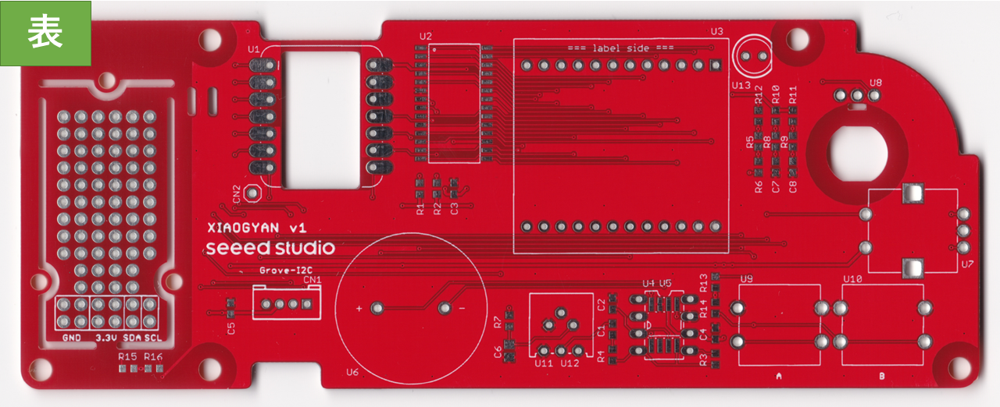
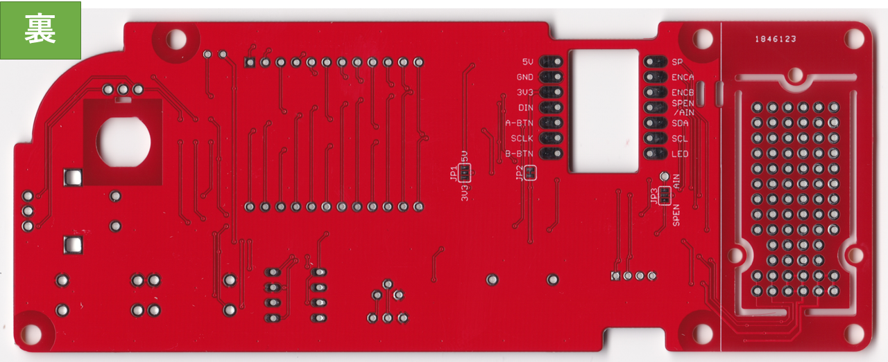
基板の表裏を確認します．部品はすべて表面に乗ることになります．

## 2.1. 基板裏面のショートジャンパへのはんだ付け
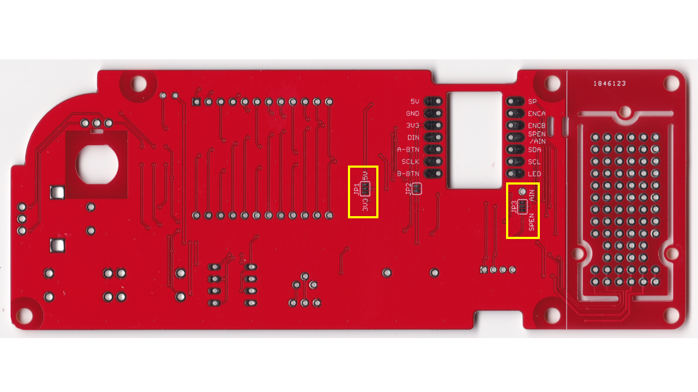
基板の裏面には2か所ほどはんだ付けでショートさせる箇所があります．
まずは，この2か所のはんだ付けから行います．

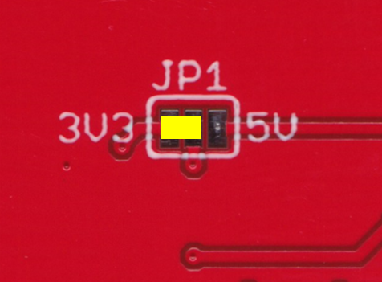
まずは**JP1のショート**から行います．
これは，LEDマトリックスを制御するドライバIC(TM1640)の動作電圧を選択する為のものです．
今回は3.3Vで動作させますので，3V3側にショートさせます．黄色の部分をはんだでショートさせて下さい．

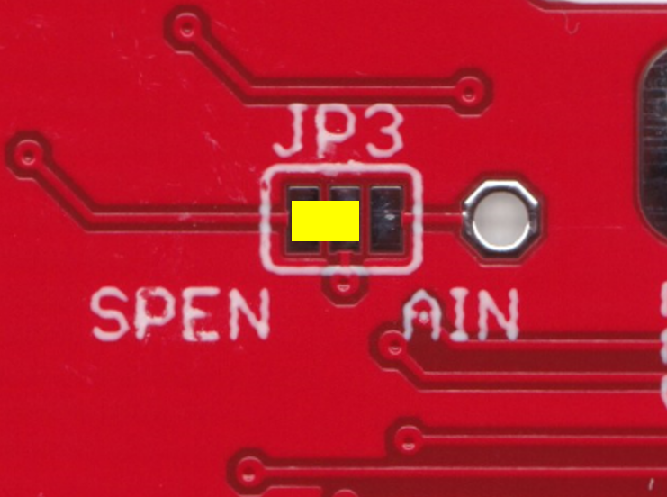
続いて**JP3のショート**を行います．
これは，マイコンのD3ピンをスピーカーの有効/無効を制御するSPeaker ENable信号として使用するか，CN2(AN1)に自己拡張した回路で使用するかを選択する為のものです．
今回はスピーカーの有効/無効を制御する用途で使用しますので，SPEN側にショートさせます．黄色の部分をはんだでショートさせて下さい．

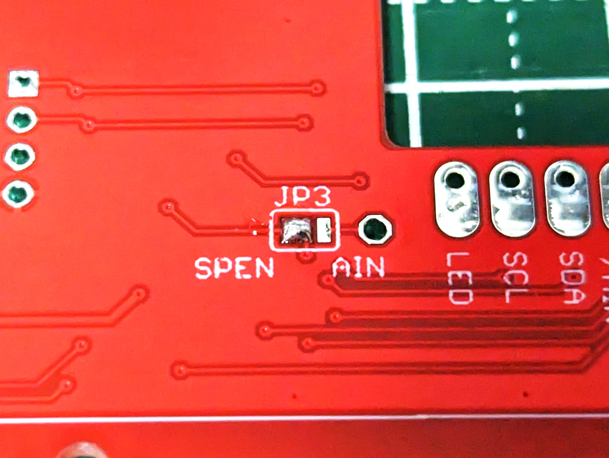

上記のように，はんだでショートさせることができたらOKです！

## 2.2. 表面実装品のはんだ付け
表面実装部品でも挿入実装部品でも **背の低い部品** からはんだ付けしていく事が鉄則です．以下の流れに沿って進めましょう．

### チップ抵抗・チップコンデンサのはんだ付けの仕方

上記のように，手順を踏んではんだ付けすると綺麗にはんだ付けできます．
②と③は，ピンセットでチップ部品を持ちつつ，別の片手ではんだごてを扱うことで実現します．（難しいですね

### 2.2.1. チップ抵抗(0Ω)のはんだ付け
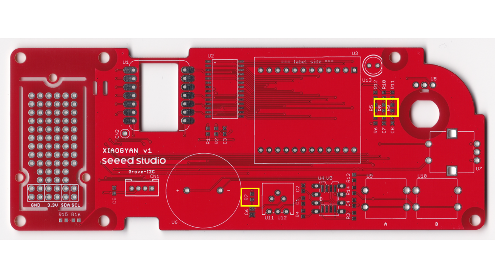

リスト①のチップ抵抗(0Ω)のはんだ付けを行います．黄枠で囲った箇所 **[R7,R8,R9]** にはんだ付けを行って下さい．

### 2.2.2. チップ抵抗(10KΩ)のはんだ付け
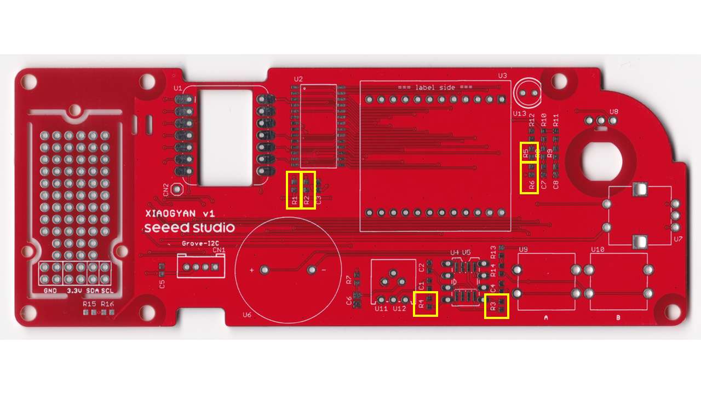

リスト②のチップ抵抗(10KΩ)のはんだ付けを行います．黄枠で囲った箇所 **[R1,R2,R3,R4,R5,R6]** にはんだ付けを行って下さい．

### 2.2.3. チップコンデンサ(0.1uF)のはんだ付け

続いてチップコンデンサを実装します．0.1uF, 1uF, 10uFの3種類のチップコンデンサを使用します．
まずはリスト③の0.1uFのコンデンサ **[C1]** を実装します．青枠で囲った箇所にはんだ付けして下さい．

### 2.2.4. チップコンデンサ(1uF)のはんだ付け
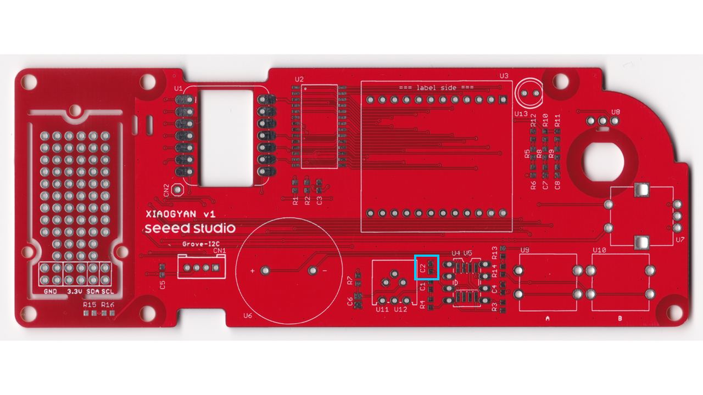

リスト④の1uFのコンデンサ **[C2]** を実装します．青枠で囲った箇所にはんだ付けして下さい．

### 2.2.5. チップコンデンサ(10uF)のはんだ付け
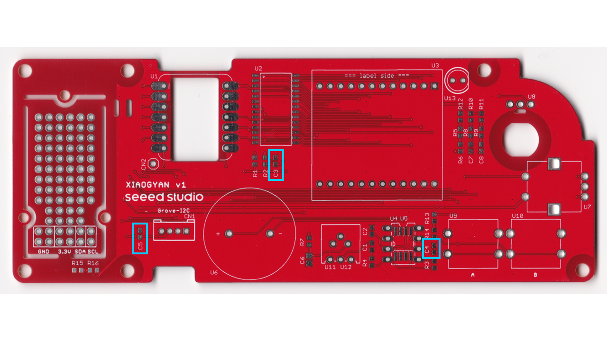

リスト⑤の10uFのコンデンサ **[C3,C4,C5]** を実装します．青枠で囲った箇所にはんだ付けして下さい．

### 2.2.6. チップ抵抗＆チップコンデンサの実装確認
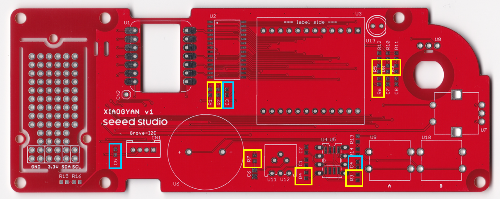

実装漏れはありませんか？あとで漏れに気づいてはんだ付けするには大変です．上図のマークアップ部分にチップ抵抗orチップコンデンサが実装されているか確認をしましょう！

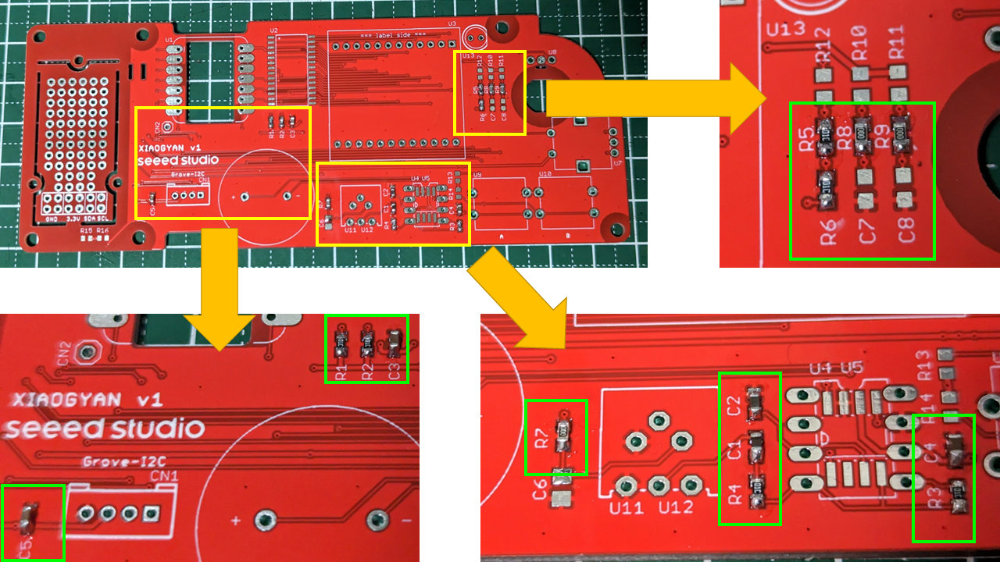

実際には上記のようにはんだ付けがなされていればOKです．

### 2.2.7. LEDドライバIC(TM1640)のはんだ付け
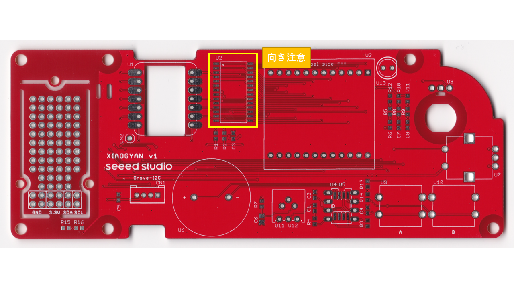

最後の表面実装です．リスト⑥のLEDドライバIC **[U2]** を実装します．黄枠で囲った箇所にはんだ付けして下さい．
尚，**本部品には取り付け向きがあります．** 注意してください．

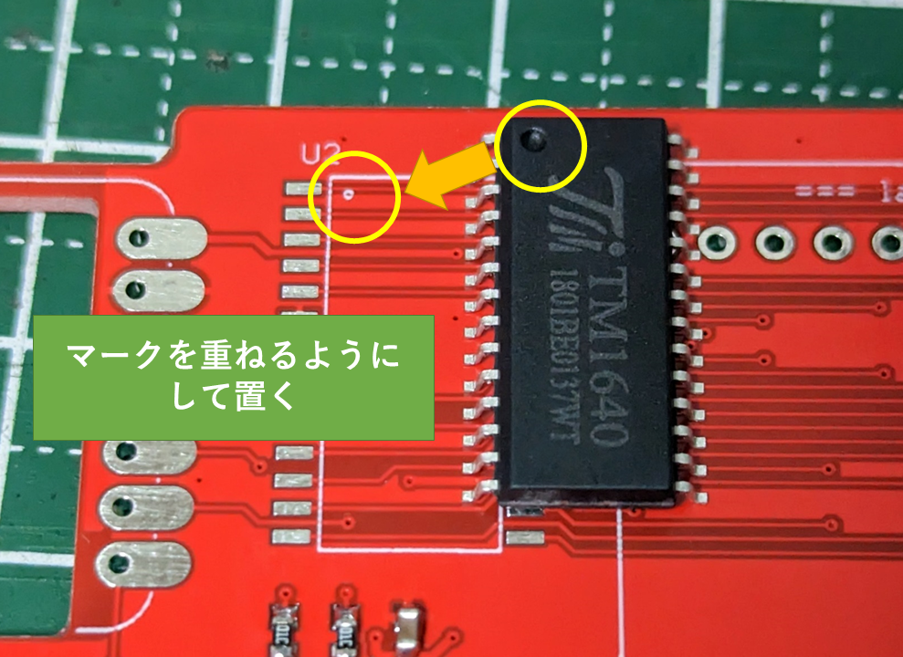

基板のU2の●にICの●が重なるように配置してください．

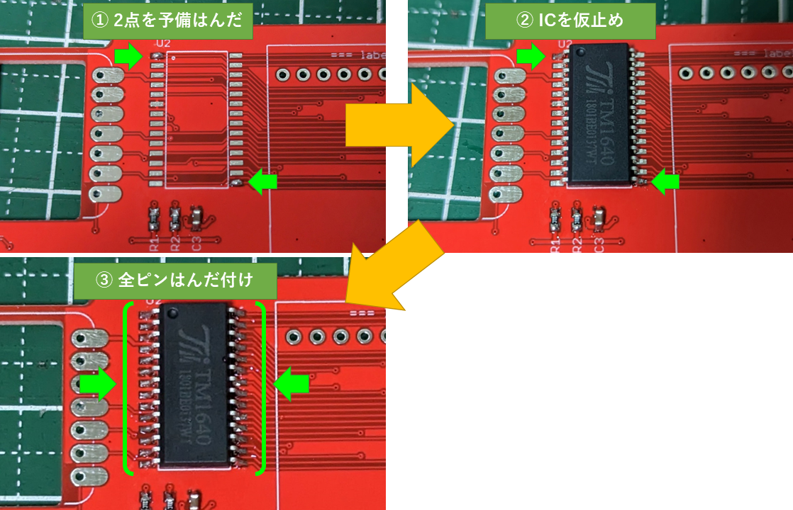

表面実装のICは上記のような手順ではんだ付けを行うと，はんだ付けが行いやすいです．

以上で表面実装部品のはんだ付けは完了です．
ひとやすみした後に挿入実装品のはんだ付けへ進んで下さい．

## 2.3. 挿入実装品のはんだ付け
挿入実装部品でも **背の低い部品** からはんだ付けしていく事が鉄則です．以下の流れに沿って進めましょう．

### 2.3.1. アンプIC(NJM2113D)のはんだ付け

リスト⑦のアンプIC **[U4]** を実装します．黄枠で囲った箇所にはんだ付けして下さい．
尚，**本部品には取り付け向きがあります．** 注意してください．

// 図を入れる

ICには取り付け向きがあります．切り欠きの向きが一致するように取り付けてください．

尚，新品のICは足がやや広がっており，そのままではソケットに挿しづらいです．
両足をやや内側に曲げた後に挿してください．

// 図を入れる

はんだ付け時に固定が難しい場合はマスキングテープを使いましょう！

### 2.3.2. ボタン・可変抵抗のはんだ付け
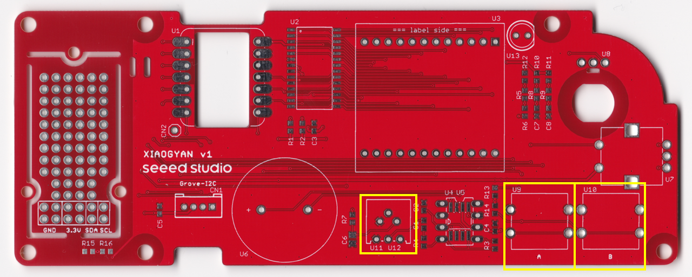

リスト⑧のボタン **[U9,U10]** ・可変抵抗 **[U11]** を実装します．黄枠で囲った箇所にはんだ付けして下さい．

可変抵抗は2種類の型番の部品が取り付くようになっています．
部品表の通りに部品を購入されている方は，▲に並んだスルーホールに刺さる可変抵抗が手元にあるはずです．

### 3. スピーカー・LEDマトリックスのはんだ付け
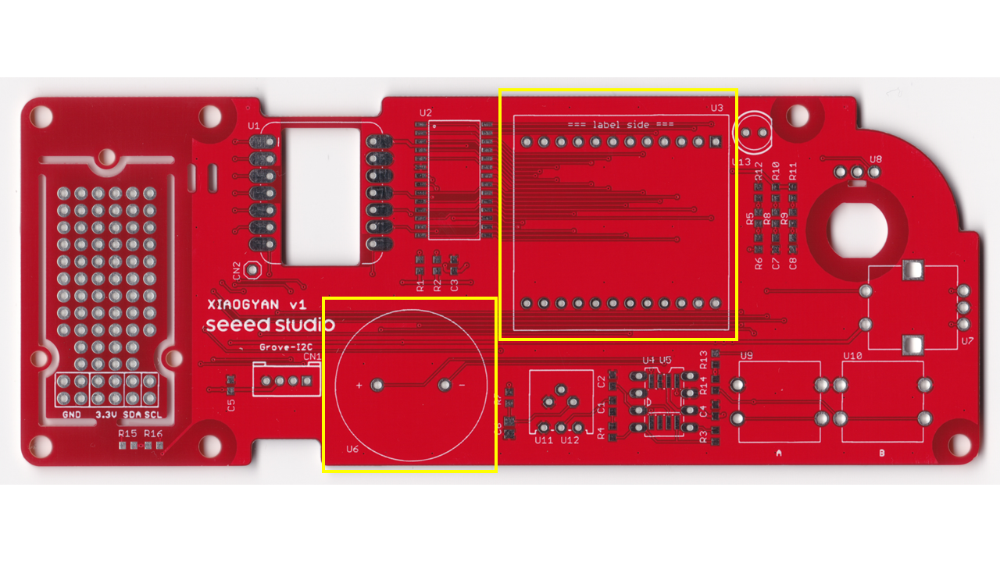

リスト⑨のスピーカー **[U6]** とリスト⑩のLEDマトリックス **[U3]** を実装します．黄枠で囲った箇所にはんだ付けして下さい．
尚，**2つの部品には取り付け向きがあります．** 注意してください．

// 図を入れる

スピーカーの場合，部品裏面にある+と-が，基板の+と-に一致するように取り付けてください．
また，はんだ付け時に固定が難しい場合はマスキングテープを使いましょう！

// 図を入れる

LEDマトリックスの場合，側面に印字された「型番ラベル」と基板に印字された「=== label side ===」が，一致するように取り付けてください．
また，はんだ付け時に固定が難しい場合はマスキングテープを使いましょう！

### 2.3.4. Groveコネクタのはんだ付け
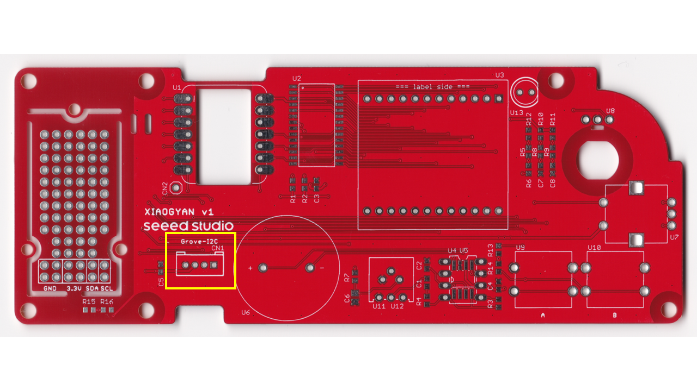

リスト⑪のGroveコネクタ **[CN1]** を実装します．黄枠で囲った箇所にはんだ付けして下さい．
尚，**本部品には取り付け向きがあります．** 注意してください．

// 図を入れる

コネクタの突起が基板のシルクと一致するような向きで取り付けてください．
また，はんだ付け時に固定が難しい場合はマスキングテープを使いましょう！

### 2.3.5. マイコンの取り付け

// 図を入れる

リスト⑬のマイコンに対して，リスト⑫の細ピンヘッダを実装します．
細ピンヘッダを実装する事により，マイコンをXIAOGYANから取り外すことが可能となり他のXIAOシリーズのマイコンに置き換えることも可能となります．

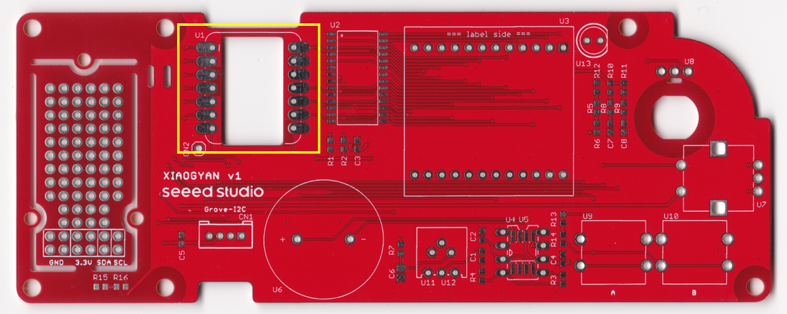

リスト⑫の分割ロングピンソケットを実装します．黄枠で囲った箇所にはんだ付けして下さい．
はんだ付け時に固定が難しい場合はマスキングテープを使いましょう！

はんだ付けの終了後は，ピンソケットにマイコンを刺して下さい．

### 2.3.6. ロータリーエンコーダーのはんだ付け

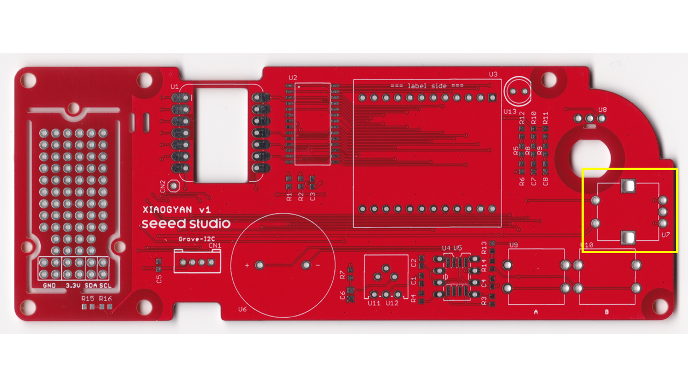

リスト⑭のロータリーエンコーダー **[U7]** を実装します．黄枠で囲った箇所にはんだ付けして下さい．
ロータリーエンコーダーは2種類のエンコーダーが取り付くようになっています．
推奨品の場合は赤枠に，オプション品の場合は黄枠に取り付けます．

推奨品(赤枠)の場合は，他の部品と同様に上記のように取り付けます．

オプション品(青枠)の場合は，基板の裏面から取付穴に部品を固定した後にはんだ付けを行います．
エンコーダの足と基板のスルーホールまでは距離がありますが，足を反対側に折り曲げると綺麗に届きます．

## 2.4. 足の取り付け

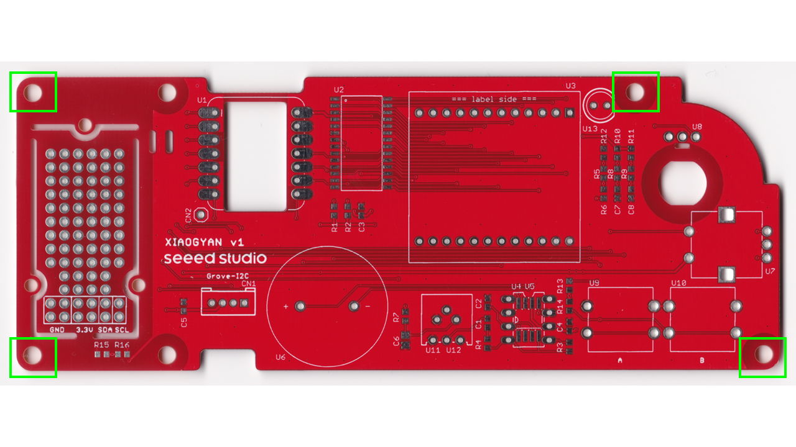

基板の4ヶ所にはφ3.5mmの穴があいています．
基板の裏面が不用意にショートして故障とならないよう足を取り付けましょう．

## 2.5. アンテナの固定

ケーブルタイを使用することで，マイコン(Seeeduino XIAO ESP32C3)のアンテナを固定する事ができます．
お好みで固定してください．

## 2.6. 基板の左部分のユニバーサル基板について

XIAOGYANにセンサ等を拡張したい時に使用できるユニバーサル基板です．
自由に活用ください．

以上で組立作業は完了です．お疲れ様でした．
再度ひとやすみをした後に，基板の動作確認を行っていきます．

# 3. 動作確認
## 3.1. ショートチェック
基板に火を入れる(通電する)前に，致命的なミスが無いか最低限のチェックを行います．

これより電源ラインのショートチェックを行います．
マイコンのXIAO ESP32C3には5Vおよび3.3Vの2つの電源系統が存在します．(XIAOGYANでは3.3V電源しか使用していませんが)

電源とGND間の抵抗値が低い場合，基板のどこかに短絡の可能性があり，このまま通電すると高い確率で壊れます．

そこで，テスターを抵抗レンジに設定し，測定ポイントのA～Cの抵抗値をそれぞれ計測します．

## 3.2. 開発環境の構築
推奨環境はVSCode+PlatformIOです．
構築方法は別ページをご覧ください．

## 3.3. 動作確認プログラムの書き込み
- [HardwareTest](https://github.com/algyan/xiaogyan_examples/tree/main/platformio/HardwareTest)

HardwareTestを手元にcloneして書き込んでみて下さい！

## 3.4. 動作の確認

チェックリストを埋めたらOK！完成！やったね！
