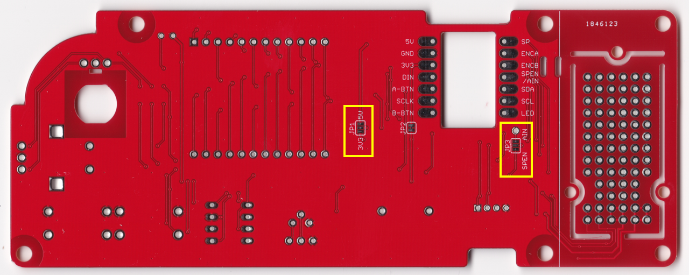

# XIAOGYANの組立手順

IoT ALGYANの8周年基板の組立手順を示します．

# はじめに
ハードウェア構成のイメージを持った後に，**部品の確認**と**機材の確認**を行いましょう！

## ハードウェアの構成の理解

XIAOGYANの構成は，マイコン(XIAO ESP32C3)を中心に，入力としてロータリーエンコーダー，ボタン×2と，出力としてLEDマトリックス，スピーカーを有します．
また，ロータリーエンコーダーには，LEDが内蔵されています．この内蔵LEDの制御信号(D6)は分岐しており，基板上のLED(U13・未実装)にも接続されています．

加えて，I2Cの信号線が繋がるGroveコネクタも用意されており，任意のGroveモジュール(3.3V駆動品)を拡張する事も可能です．
I2Cの制御信号は，基板左のユニバーサル基板の区画にも伸びています．このユニバーサル基板に回路を拡張すればすべてオンボードとすることも可能です．

## 部品の確認
// 図を入れる

- [部品の確認表](hoge.html)

以下の確認表をダウンロード後に印刷し，部品に過不足がないことを確認しましょう．
**※**マークのついた部品は，オプション品です．手元に無くとも組立は可能です．

## 機材の確認

上記に組立に必要な機材のリストを示します．機材は手元に揃っていますか？
**※**マークのついた部品は，オプションです．手元に無くとも組立は可能です．

## 組立＆動作確認の流れ
以降でXIAOGYANの組立＆動作確認を行います．組立は手慣れた人で2時間程度かと思われます．
流れは以下の通りです．

1. 組立作業
    1. 部品の用意
    2. 表面実装品のはんだ付け
    3. 挿入実装品のはんだ付け
    4. 足の取り付け
    5. アンテナの固定
2. 動作確認
    1. ショートチェック
    2. 開発環境の構築
    3. 動作確認プログラムの書き込み
    4. 動作の確認

# 組立作業
## 部品の用意
[部品の確認]にて既に用意が済んでいるかもしれませんが，今一度確認します．

1. チップ抵抗やチップコンデンサは，袋から取り出すと，容量の確認が非常に困難です．袋から取り出す際には必ず容量(XXXΩ，YYYuFなど)を紙テープに書き込みましょう．

2. 部品の確認表に**赤字で【極性あり】**と書かれている部品は，**取り付けに向きがあります．**はんだ付けの際には注意しましょう．

3. それでは部品の確認表に部品を並べましょう！

## はんだ付けの経験が浅い方へ
https://www.youtube.com/watch?v=dQ7AUjb1tkA

イチケンさんのはんだ付け動画が分かりやすいです．
一度，ご覧の上以降の作業に進んで下さい．

## 基板の確認

基板の表裏を確認します．部品はすべて表面に乗ることになります．

## 基板裏面のショートジャンパ

基板の裏面には2か所ほどはんだ付けでショートさせる箇所があります．
まずは，この2か所のはんだ付けから行います．

まずはJP1のショートから行います．
これは，LEDマトリックスを制御するドライバIC(TM1640)の動作電圧を選択する為のものです．
今回は3.3Vで動作させますので，3V3側にショートさせます．黄色の部分をはんだでショートさせて下さい．

続いてJP3のショートを行います．
これは，マイコンのD3ピンをスピーカーの有効/無効を制御するSPeaker ENable信号として使用するか，CN2(AN1)に自己拡張した回路で使用するかを選択する為のものです．
今回はスピーカーの有効/無効を制御する用途で使用しますので，SPEN側にショートさせます．黄色の部分をはんだでショートさせて下さい．

## 表面実装品のはんだ付け
表面実装部品でも挿入実装部品でも**背の低い部品**からはんだ付けしていく事が鉄則です．以下の流れに沿って進めましょう．

0. 初めて表面実装のはんだ付けを行う方へ
初めて表面実装のはんだ付けを行う方は，以下のリンク先から表面実装部品のはんだ付け方法について確認ください．わかりやすく解説されています．

- [古賀電子 > 表面実装部品(SMD)のはんだ付け](https://www.kogadenshi.co.jp/%E5%8D%8A%E7%94%B0%E4%BB%98%E3%81%91%E3%83%86%E3%82%AF%E3%83%8B%E3%83%83%E3%82%AF/%E8%A1%A8%E9%9D%A2%E5%AE%9F%E8%A3%85%E9%83%A8%E5%93%81-smd-%E3%81%AE%E5%8D%8A%E7%94%B0%E4%BB%98%E3%81%91/)

1. チップ抵抗(0Ω)のはんだ付け

// 図を入れる

黄枠で囲った箇所のはんだ付けを行います．
R5,R10,R11に0Ω抵抗をはんだ付け下さい．

2. チップ抵抗(10KΩ)のはんだ付け

// 図を入れる

黄枠で囲った箇所のはんだ付けを行います．
すべて10kΩ抵抗です．
緑枠で囲った箇所は，LEDの電流制限抵抗です．10kΩ抵抗を基本的には実装します．が，LEDが暗いと感じる方は100Ω抵抗を実装下さい．

尚，極性は特にありませんが，同じ向きに揃えて実装できると綺麗ですね :-)

3. チップコンデンサ(0.1uF)のはんだ付け
// 図を入れる

コンデンサは，0.1uF, 1uF, 10uFの3種類のチップコンデンサを使用します．
まずは**0.1uFのコンデンサ**を実装します．赤枠で囲った箇所にはんだ付けして下さい．

4. チップコンデンサ(1uF)のはんだ付け
// 図を入れる

**1uFのコンデンサ**を実装します．赤枠で囲った箇所にはんだ付けして下さい．

5. チップコンデンサ(10uF)のはんだ付け
// 図を入れる

**10uFのコンデンサ**を実装します．赤枠で囲った箇所にはんだ付けして下さい．

6. LEDドライバIC(TM1640)のはんだ付け
// 図を入れる

LEDドライバICを実装します．赤枠で囲った箇所にはんだ付けして下さい．
尚，**本部品には極性があります．**

// 図を入れる

基板のU2の●にICの●が重なる事を確認した後に，はんだ付けをして下さい．

以上で表面実装部品のはんだ付けは完了です．
ひとやすみした後に挿入実装品のはんだ付けへ進んで下さい．

## 挿入実装品のはんだ付け
挿入実装部品でも**背の低い部品**からはんだ付けしていく事が鉄則です．以下の流れに沿って進めましょう．

1. アンプIC(NJM2113D)のはんだ付け

固定が難しい場合はマスキングテープを使いましょう！
ICには取り付け向きがあります．切り欠きの向きが一致するように取り付けてください．

2. スイッチ・可変抵抗・LEDのはんだ付け
// 図を入れる

可変抵抗は2種類の型番の部品が取り付くようになっています．
部品表の通りに部品を購入されている方は，▲に並んだスルーホールに刺さる可変抵抗が手元にあるはずです．

LEDは必須ではありません．手元にお持ちの場合はこのタイミングではんだ付けしましょう．

3. スピーカ・マトリクスLEDのはんだ付け

4. ロータリエンコーダのはんだ付け
// 図を入れる

ロータリエンコーダは2種類のエンコーダが取り付くようになっています．
推奨品の場合は赤枠に，オプション品の場合は青枠に取り付けます．

推奨品(赤枠)の場合は，他の部品と同様に上記のように取り付けます．

オプション品(青枠)の場合は，基板の裏面から取付穴に部品を固定した後にはんだ付けを行います．
エンコーダの足と基板のスルーホールまでは距離がありますが，足を反対側に折り曲げると綺麗に届きます．

5. Groveコネクタのはんだ付け

6. マイコンおよびICの取り付け
// 図を入れる

最始に取り付けたソケットに，マイコンおよびICを取り付けます．
マイコンにもICにも取り付け向きがあります．注意してください．

// 図を入れる

ICは切り欠きの向きを揃えるように取り付けてください．
尚，新品のICは足がやや広がっており，そのままではソケットに挿しづらいです．
両足をやや内側に曲げた後に挿してください．

## 足の取り付け
基板の4ヶ所にはφ3.5mmの穴があいています．
基板の裏面が不用意にショートして故障とならないよう足を取り付けましょう．

## アンテナの固定

ケーブルタイを使用することで，マイコン(Seeeduino XIAO ESP32C3)のアンテナを固定する事ができます．
お好みで固定してください．

## 基板の左部分について
XIAOGYANにセンサ等を拡張したい時に使用できるユーザランドです．
自由に活用ください．

以上で組立作業は完了です．お疲れ様でした．
続いては基板の動作確認を行っていきます．

# 動作確認
## ショートチェック
基板に火を入れる(通電する)前に，致命的なミスが無いか最低限のチェックを行います．

これより電源ラインのショートチェックを行います．
XIAOGYANには5Vおよび3.3Vの2つの電源系統が存在します．電源とGND間の抵抗値が低い場合，基板のどこかに短絡の可能性があり，このまま通電すると高い確率で壊れます．

そこで，テスターを抵抗レンジに設定し，測定ポイントのA～Cの抵抗値をそれぞれ計測します．

## 開発環境の構築
推奨環境はVSCode+PlatformIOです．
構築方法は別ページをご覧ください．

## 動作確認プログラムの書き込み
HardwareTestを手元にcloneして書き込んでみて下さい！

## 動作の確認
チェックリストを埋めたらOK！完成！やったね！
