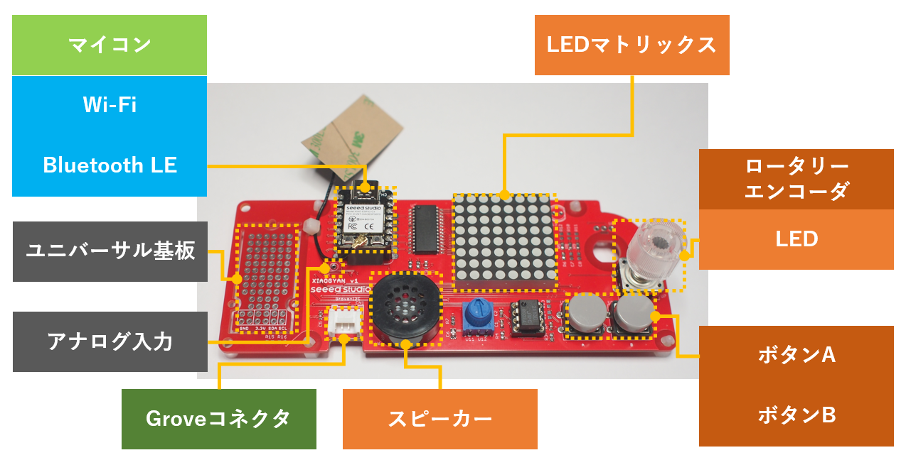
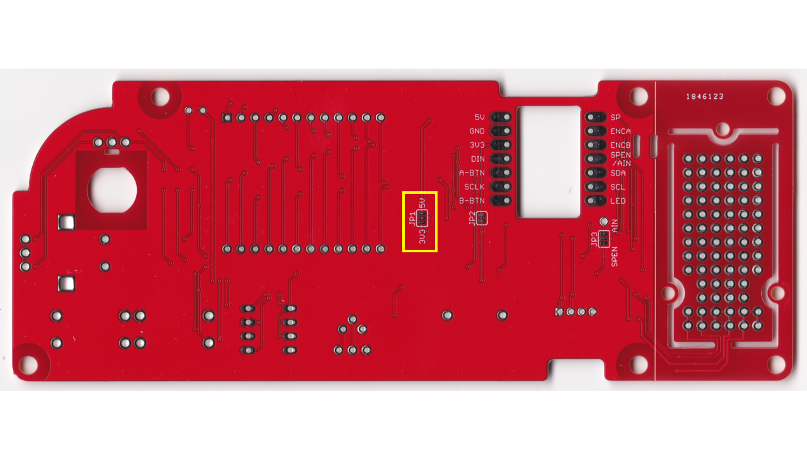
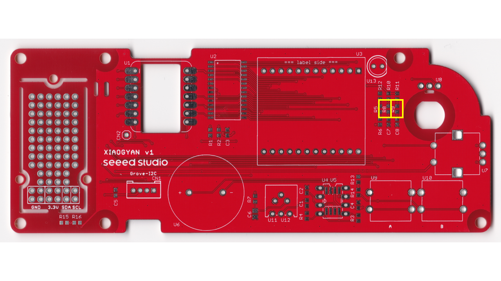
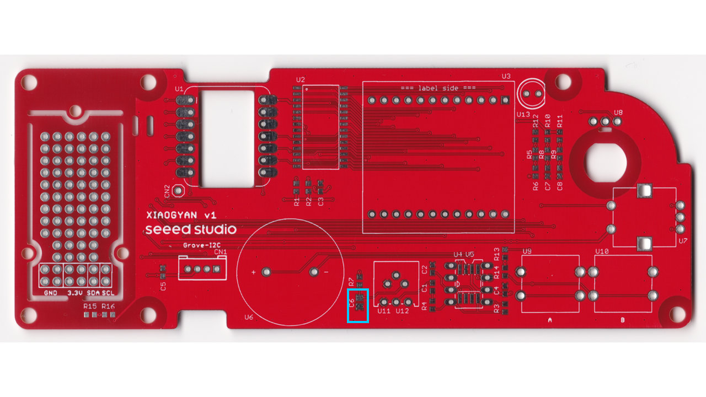
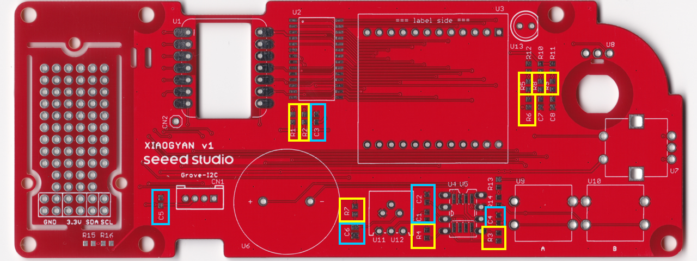
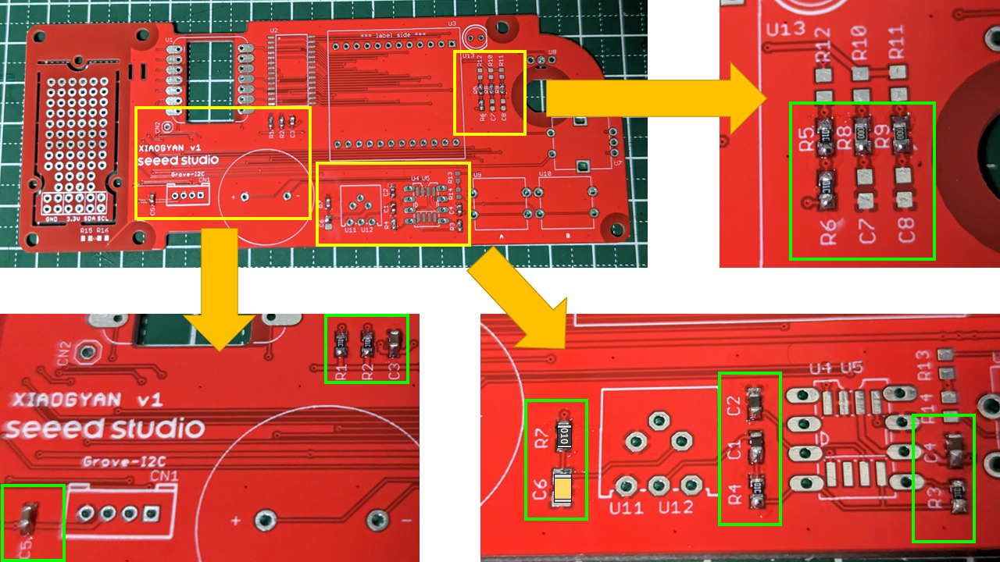
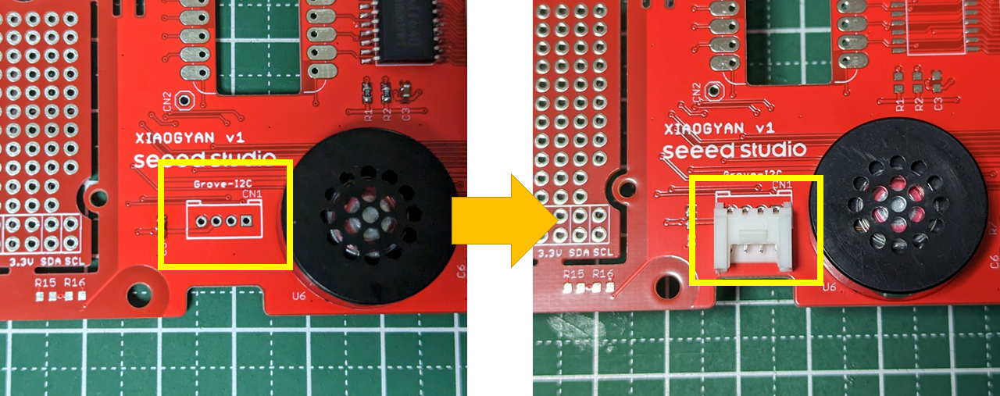
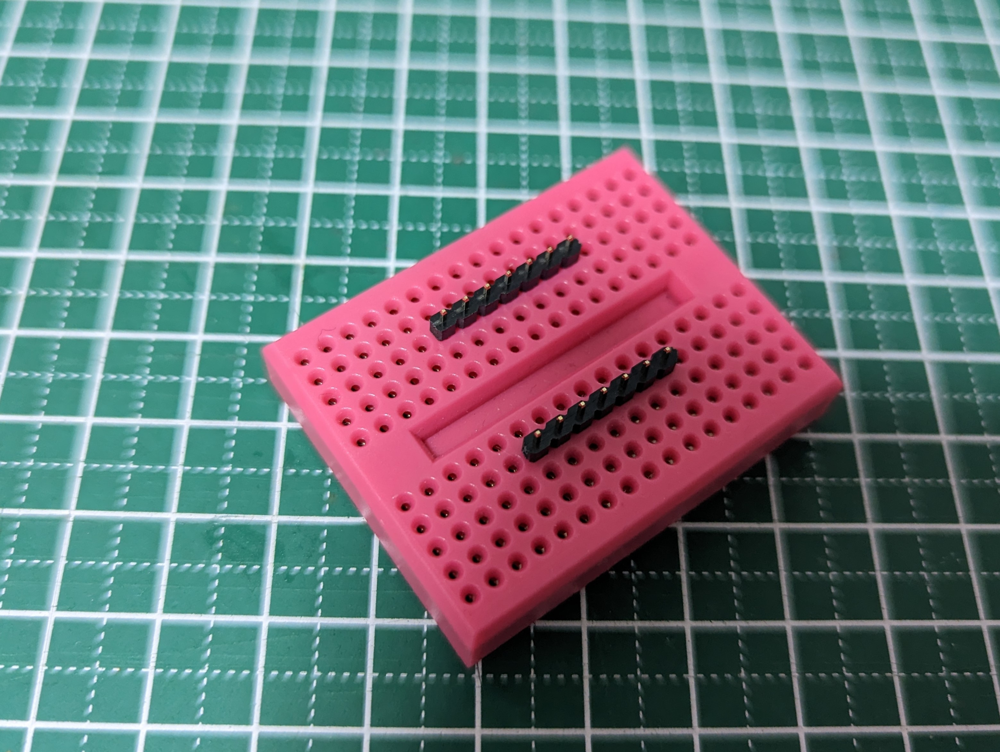
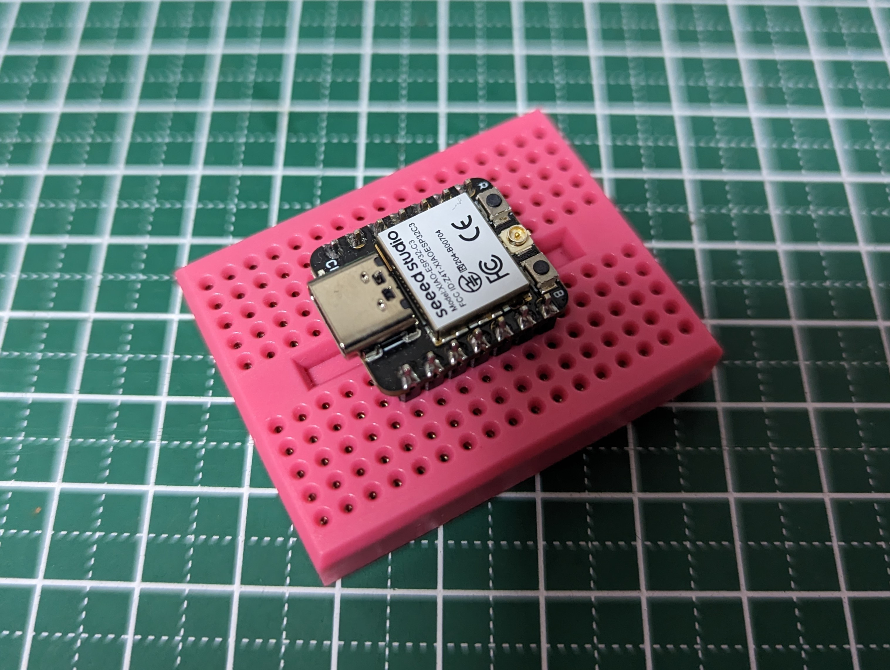

# XIAOGYAN 組立マニュアル

「XIAOGYAN」の組立手順です．

## 1. はじめに

ハードウェア構成のイメージを持った後に，**部品の確認**と**機材の確認**を行いましょう！

### 1.1. ハードウェア構成の理解

  

XIAOGYANの構成は，マイコン(XIAO ESP32C3)を中心に，入力としてロータリーエンコーダー，ボタン×2と，出力としてLEDマトリックス，スピーカーを有します．
また，ロータリーエンコーダーには，LEDが内蔵されています．この内蔵LEDの制御信号(D6)は分岐しており，基板上のLED(U13・未実装)にも接続されています．

加えて，I2Cの信号線が繋がるGroveコネクタも用意されており，任意のGroveモジュール(3.3V駆動品)を拡張する事も可能です．
I2Cの制御信号は，基板左のユニバーサル基板の区画にも伸びています．このユニバーサル基板に回路を拡張すればすべてオンボードとすることも可能です．

### 1.2. 完成品を見ておこう

先に完成したXIAOGYANを見ておきましょう！
沢山，はんだ付けする部品があるように見えますが，1つ1つ取り組んでいけばバッチリ組み上がります．頑張っていきましょう！

### 1.3. 部品の確認

それでは，まず上記の[部品貼付台紙](../../hardware/xiaogyan_pasteboard.v1.pdf)をダウンロード＆印刷し，部品を並べることで部品の不足が無いことを確認しましょう．

1. チップ抵抗やチップコンデンサは，袋から取り出すと，容量の確認が非常に困難です．袋から取り出す際には必ず容量(10KΩ，0.1uFなど)を紙テープに書き込みましょう．
2. 部品の確認表に**赤字で「向き注意」** と書かれている部品は，**取り付けに向きがあります．** はんだ付けの際には注意しましょう．
3. それでは部品貼付台紙に部品を並べましょう！

実際に並べると上記のようになります．

### 1.4. 機材の確認

上記に組立に必要な機材のリストを示します．機材は手元に揃っていますか？
**※** マークのついた部品は，オプションです．手元に無くとも組立は可能です．

| 必須／オプション | 品名 | メモ |
| :---: | --- | --- |
| 必須 | はんだごて，こて台 |  |
| 必須 | 糸はんだ | 今回は鉛入り，ヤニ入り，φ0.6mmを使用 |
| 必須 | ニッパー，ピンセット | 部品の足をカットしたり，細かい部品を掴んだり |
| 必須 | テスター | 主に動作確認で使用 |
| ※1 | はんだ吸い取り線 or はんだ吸い取り器 | はんだを付け間違えた際のリカバリで使用します．どちらかあった方が無難 |
| ※2 | マスキングテープ | はんだ付け時に，部品の固定が難しい場合に使いましょう！ |

### 1.5. 組立＆動作確認の流れ

以降でXIAOGYANの組立＆動作確認を行います．組立は手慣れた人で1～2時間程度かと思われます．
流れは以下の通りです．

* 組立作業
    * 基板裏面のショートジャンパへのはんだ付け
    * 表面実装品のはんだ付け
    * 挿入実装品のはんだ付け
    * 足の取り付け
    * アンテナの固定
* チェック
    * ショートチェック

## 2. 組立作業

### 2.1. はんだ付けの経験が無い/浅い方へ

Youtberのイチケンさんの[はんだ付け動画](https://www.youtube.com/watch?v=dQ7AUjb1tkA)が分かりやすいです．
はんだ付けの経験が無い/浅い方は，一度ご覧の上で以降の作業に進むことをオススメします．表面実装の経験が無い方もぜひ！

### 2.2. 基板の確認

基板の表裏を確認します．部品はすべて表面に乗ることになります．

### 2.3. 基板裏面のショートジャンパへのはんだ付け

基板の裏面には3箇所(JP1～JP3)ほど，はんだ付けでショートさせる事によって回路を変更できる箇所があります．
まずは，このはんだ付けから行います．

今回の組立では，**JP1のみショート**させます．
JP1は，LEDマトリックスを制御するドライバIC(TM1640)の動作電圧を選択する為のものです．
今回は3.3Vで動作させますので，3V3側にショートさせます．黄色の部分をはんだでショートさせて下さい．

### 2.4. 表面実装品のはんだ付け

表面実装部品でも挿入実装部品でも **背の低い部品** からはんだ付けしていく事が鉄則です．以下の流れに沿って進めましょう．

#### 2.4.1. チップ抵抗・チップコンデンサのはんだ付けの仕方

上記のように，手順を踏んではんだ付けすると綺麗にはんだ付けできます．
②と③は，ピンセットでチップ部品を持ちつつ，もう片方の手ではんだごてを扱うことで実現できます．（難しいですね

#### 2.4.2. チップ抵抗(0Ω)のはんだ付け

リスト①のチップ抵抗(0Ω)のはんだ付けを行います．黄枠で囲った箇所 **[R8,R9]** にはんだ付けを行って下さい．

#### 2.4.3. チップ抵抗(10KΩ)のはんだ付け

リスト②のチップ抵抗(10KΩ)のはんだ付けを行います．黄枠で囲った箇所 **[R1,R2,R3,R4,R5,R6,R7]** にはんだ付けを行って下さい．

#### 2.4.4. チップコンデンサ(0.1uF)のはんだ付け

続いてチップコンデンサを実装します．0.1uF, 1uF, 10uF, 1000pFの4種類のチップコンデンサを使用します．
まずはリスト③の0.1uFのコンデンサ **[C1]** を実装します．青枠で囲った箇所にはんだ付けして下さい．

#### 2.4.5. チップコンデンサ(1uF)のはんだ付け

リスト④の1uFのコンデンサ **[C2]** を実装します．青枠で囲った箇所にはんだ付けして下さい．

#### 2.4.6. チップコンデンサ(10uF)のはんだ付け

リスト⑤の10uFのコンデンサ **[C3,C4,C5]** を実装します．青枠で囲った箇所にはんだ付けして下さい．

#### 2.4.7. チップコンデンサ(1000pF)のはんだ付け

リスト⑯の10uFのコンデンサ **[C6]** を実装します．青枠で囲った箇所にはんだ付けして下さい．

#### 2.4.8. チップ抵抗＆チップコンデンサの実装確認

実装漏れはありませんか？あとで漏れに気づいてはんだ付けするには大変です．上図のマークアップ部分にチップ抵抗orチップコンデンサが実装されているか確認をしましょう！

実際には上記のようにはんだ付けがなされていればOKです．

#### 2.4.9. LEDドライバIC(TM1640)のはんだ付け

最後の表面実装です．リスト⑥のLEDドライバIC **[U2]** を実装します．黄枠で囲った箇所にはんだ付けして下さい．
尚，**本部品には取り付け向きがあります．** 注意してください．

基板のU2の●にICの●が重なるように配置してください．

表面実装のICは上記のような手順ではんだ付けを行うと，はんだ付けが行いやすいです．

以上で表面実装部品のはんだ付けは完了です．
ひとやすみした後に挿入実装品のはんだ付けへ進んで下さい．

### 2.5. 挿入実装品のはんだ付け

挿入実装部品でも **背の低い部品** からはんだ付けしていく事が鉄則です．以下の流れに沿って進めましょう．

#### 2.5.1. アンプIC(NJM2113D)のはんだ付け

リスト⑦のアンプIC **[U4]** を実装します．黄枠で囲った箇所にはんだ付けして下さい．
尚，**本部品には取り付け向きがあります．** 注意してください．

新品のICは，足がハの字に広がっている為に基板へ挿しづらいです．上記の図のように平らな面に指で押しつけて両足をやや内側に曲げた後に挿してください．

ICには取り付け向きがあります．切り欠きの向きが一致するように取り付けてください．
はんだ付けの時に，ICが抜け落ちてしまう場合は，マスキングテープで固定するとはんだ付けがやりやすいです．

#### 2.5.2. ボタン・可変抵抗のはんだ付け

リスト⑧のボタン **[U9,U10]** ・可変抵抗 **[U11]** を実装します．黄枠で囲った箇所にはんだ付けして下さい．

実際に取り付けると，上記の図のようになります．

#### 2.5.3. スピーカー・LEDマトリックスのはんだ付け

リスト⑨のスピーカー **[U6]** とリスト⑩のLEDマトリックス **[U3]** を実装します．黄枠で囲った箇所にはんだ付けして下さい．
尚，**2つの部品には取り付け向きがあります．** 注意してください．

スピーカーの場合，部品裏面にある+と-が，基板の+と-に一致するように取り付けてください．
また，はんだ付け時に固定が難しい場合はマスキングテープを使いましょう！

LEDマトリックスの場合，側面に印字された「型番ラベル」と基板に印字された「=== label side ===」が，一致するように取り付けてください．
また，はんだ付け時に固定が難しい場合はマスキングテープを使いましょう！

#### 2.5.4. Groveコネクタのはんだ付け

リスト⑪のGroveコネクタ **[CN1]** を実装します．黄枠で囲った箇所にはんだ付けして下さい．
尚，**本部品には取り付け向きがあります．** 注意してください．

コネクタの突起が基板のシルクと一致するような向きで取り付けてください．
また，はんだ付け時に固定が難しい場合はマスキングテープを使いましょう！

#### 2.5.5. マイコンの取り付け

  

リスト⑬のマイコンに対して，リスト⑫の細ピンヘッダを実装します．上記の図のようにお手持ちのブレッドボードに細ピンヘッダを挿して固定した後にはんだ付けを行うと楽です．
尚，この細ピンヘッダを実装する事により，マイコンをXIAOGYANから取り外すことが可能となり他のXIAOシリーズのマイコンに置き換えることが可能となります．

リスト⑫の分割ロングピンソケットを実装します．黄枠で囲った箇所にはんだ付けして下さい．
はんだ付け時に固定が難しい場合はマスキングテープを使いましょう！

はんだ付けの終了後は，ピンソケットにマイコンを刺して下さい．

#### 2.5.6. ロータリーエンコーダーのはんだ付け

リスト⑭のロータリーエンコーダー **[U7]** を実装します．黄枠で囲った箇所にはんだ付けして下さい．

  

実際の取り付けると上記の図のようになります．
キャップは最後に取り付けると良いでしょう．(キャップは一度取り付けると，取り外しが困難である為，注意ください）

### 2.6. 足の取り付け

基板の裏面が不用意にショートして故障とならないよう足を取り付けましょう．
リスト⑮の基板スペーサ―を，黄枠で囲った4箇所に取り付けて下さい．

### 2.7. アンテナの固定

緑枠の箇所にケーブルタイを通すことで，マイコン(Seeeduino XIAO ESP32C3)のアンテナを固定する事ができます．
お好みで固定してください．

このように固定できます．

### 2.8. 基板の左部分のユニバーサル基板について

XIAOGYANにセンサ等を拡張したい時に使用できるユニバーサル基板です．
自由に活用ください．

以上で組立作業は完了です．お疲れ様でした．
再度ひとやすみをした後に，基板の動作確認を行っていきます．

## 3. チェック

### 3.1. ショートチェック

基板に火を入れる(通電する)前に，致命的なミスが無いか最低限のチェックを行います．

これより電源ラインのショートチェックを行います．
マイコンのXIAO ESP32C3には5Vおよび3.3Vの2つの電源系統が存在します．(XIAOGYANでは3.3V電源しか使用していませんが)

電源とGND間の抵抗値が低い場合，基板のどこかに短絡の可能性があり，このまま通電すると高い確率で壊れます．

そこで，テスターを抵抗レンジに設定し，測定ポイントのA～Cの抵抗値をそれぞれ計測します．

| 測定ポイント | 参考値 |
| --- | --- | 
| A-B(5V-GND) | 数十kΩ以上 |
| C-B(3.3V-GND) | 数MΩ以上 |
| A-C(5V-3.3V) | 数十kΩ以上 |

測定ポイント間の抵抗値が参考値を大幅に下回る場合は，はんだ付けを見直してみて下さい．
(部品の取り付け向きや，意図しないショートなど)

## 4. 完了

以上でXIAOGYANの組立は完了です．お疲れ様でした！！１
