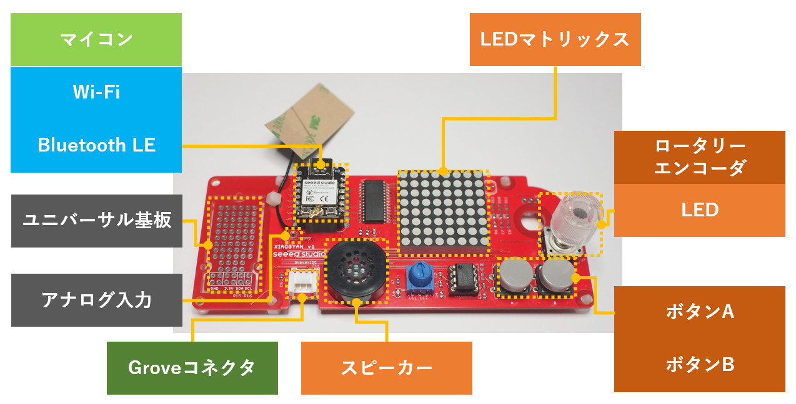
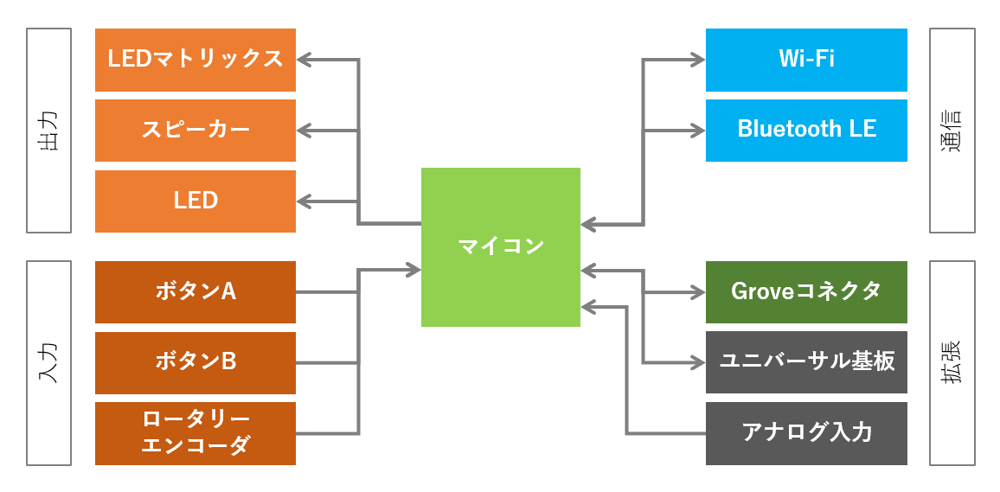

# XIAOGYAN しおり🔖

ようこそ！XIAOGYANプロジェクトへ！

近年、電子工作がマジでお手軽になりましたね。ネットでポチれば数日で手元にくるし、高機能なマイコンやセンサーなども1個でも買うことができるようになりました。しかもお小遣い程度の金額で。数百万円出さないと使えなかった開発ツールは同等のものがタダで手に入ります。やる気と行動力さえあれば「わたしの欲しかったわたしのためのデバイス」を作って動かすことができちゃいます。
最近は、M5StackやreTerminalのようなディスプレイやボタンが付いているケース入りの製品で、センサーなどをコネクタで繋いでソフトウェアをチョイと書いてパッと仕上げること可能です。

便利になった反面、ちょっと寂しいなと思うところがあります。はんだ付けがうまくできたとかできなかったとか、部品壊れた悲しいとか。一喜一憂する電子工作の楽しさが減ってしまっているような気がしています。

そこで、オリジナルIoTデバイス**XIAOGYAN**をALGYANコミュニティで先導（扇動？）することにしました。

* デバイス、ファームウェア、クラウドの全てをオープン、カスタマイズ可能に
* 入手しやすい部品
* 部品代は3000円以内
* 開発PCはWindows, macOS, Linux
* プロジェクトの進行もオープンに

見ているだけではダメです！
XIAOGYANプロジェクトに参加して、ぜひ一緒に楽しみましょう。

## XIAOGYANデバイス

XIAOGYANプロジェクトで用意したデバイスがこちらです。

心臓部となるマイコンに[Seeed Studio XIAO ESP32C3](https://wiki.seeedstudio.com/XIAO_ESP32C3_Getting_Started)を採用しました。
このマイコンはWi-FiやBluetooth LEでクラウドやスマートフォンと通信することができます。アンテナが外付けなのでやり場に困るのですが、基板に結束バンドで固定できるようにしました。

そして、マイコンにそこそこ楽しめそうな電子部品を追加しました。

* 出力
    * LEDマトリックス

        ちょっとした表示（8x8ドットのLED）ができます。  
        液晶ディスプレイのほうがドットが多くて表示の自由度が高いのですが、ここはあえてLEDマトリックスにしました。このLEDマトリックスは各ドットに赤と緑のLEDが内蔵されていて、赤色,緑色,オレンジ色,消灯の4つを状態を表示できます。

    * スピーカー

        音が出せます。  
        オーディオパワーアンプを付けたので、結構な音量で出せます。FM音源LSIなどは載せていませんが、ファームウェアをがんばって作れば凝った音が出せるかも？

    * LED

        ロータリーエンコーダの中央を赤色に点灯できます。  
        ファームウェアのデバッグ用。

* 入力
    * ボタンA, ボタンB

        ボタン入力できます。2個。

    * ロータリーエンコーダ

        グルグルとノブを回す入力ができます。  
        この電子部品が好きなので載せました。グルグル回せるのが気持ちいいですね。右/左とか、増やす/減らすといった操作に最適です。

## 楽しみ方

### XIAOGYANを作って、動かして、改造する

1. はんだ付け🌶️
    * 電子部品販売店に部品を注文して入手
    * 基板に部品をはんだ付けして組み立て
    * ファームウェアを書き込んで動作確認
2. ケースに入れる🌶️
    * 既製品のケースに収納、固定する
3. 部品を変える🌶️🌶️
    * 互換性を維持しつつ部品を交換する
4. ファームウェアを入れる🌶️
    * サンプルのファームウェアを入れる
5. ファームウェアをいじる🌶️🌶️
    * ファームウェアのソースコードを変更する
    * 新しくファームウェアを作る
6. 機能を拡張する🌶️🌶️🌶️
    * Groveモジュールにセンサーを接続する
    * ファームウェアを変更する

### XIAOGYANをやってみて感じたこと、得たことを発信する

1. SNS（Facebook, Twitter, Instagramなど）🌶️
2. 情報共有サイト（Qiita, Zennなど）🌶️🌶️
3. イベント登壇（ALGYANなど）🌶️🌶️🌶️

### XIAOGYANを報告、提案、改善する

1. [Discussions](https://github.com/algyan/XIAOGYAN/discussions)🌶️
2. [Issues](https://github.com/algyan/XIAOGYAN/issues)🌶️🌶️
3. [Pull requests](https://github.com/algyan/XIAOGYAN/pulls)🌶️🌶️🌶️
