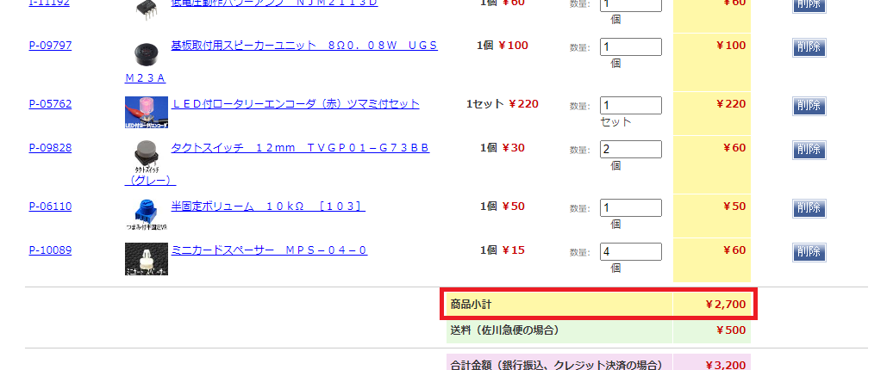

# XIAOGYAN 部品手配マニュアル🛒

XIAOGYANの完成品を入手する方法はありません。ご自身で部品を入手して、組み立てる必要があります。

必要な部品は[部品リスト](../../hardware/xiaogyan.v1.xlsx)に書いてあります。一部の部品を除き、ほとんどの部品は秋月電子通商のWebサイトで購入できます。本マニュアルを参考に、XIAOGYAN基板と部品を入手してください。

---

## 目次

1. [XIAOGYAN基板を入手](#xiaogyan基板を入手)
2. [秋月電子通商から購入](#秋月電子通商から購入)
3. [チップ抵抗（10KΩ）を購入](#チップ抵抗10kωを購入)

---

## XIAOGYAN基板を入手

XIAOGYAN基板は非売品です。IoT ALGYANコミュニティの特定イベントで配布しています。イベントに参加して入手してください。

* [IoT ALGYANコミュニティのイベント](https://algyan.connpass.com/event/)

## 秋月電子通商から購入

1. 秋月電子通商のWebサイトを開いて、部品を買い物かごに入れてください。

    下記リンクをクリックすると、秋月電子通商のWebサイトが表示されて、XIAOGYANの部品が自動的に買い物かごに入ります。

    * [秋月電子通商 部品を買い物かごに入れる](https://akizukidenshi.com/catalog/cart/cart.aspx?goods=R-11619,P-16143,P-16994,P-13161,P-09285,C-12634,M-17454,C-04398,C-10073,I-13225,I-09878,I-11192,P-09797,P-05762,P-09828,P-06110,P-10089,&qty=1,1,1,1,1,1,1,1,1,1,1,1,1,1,2,1,4,)

2. 買い物かごの部品に間違いがないか確認してください。

    商品数は17品、商品小計は2700円（2023/5/9調べ）です。

    

3. 注文してください。

    注文画面へ進み、必要事項を記入して注文してください。

## チップ抵抗（10KΩ）を購入

秋月電子通商はチップ抵抗（10KΩ）をバラ売りしていません。秋月電子通商の5000個入りを購入するか、他店で購入してください。必要数は7個です。

* 秋月電子通商 [チップ抵抗　１／１０Ｗ１０ｋΩ　（５０００個入）](https://akizukidenshi.com/catalog/g/gR-15029/)
* マルツエレック [1608角形チップ抵抗器 RK73H 10kΩ 0.1W ±1%【RK73H1JTTD1002F】](https://www.marutsu.co.jp/pc/i/857775/)
* 共立電子産業 [チップ抵抗(1608) 10kΩ★受注単位有★](https://eleshop.jp/shop/g/gABQ364/)
